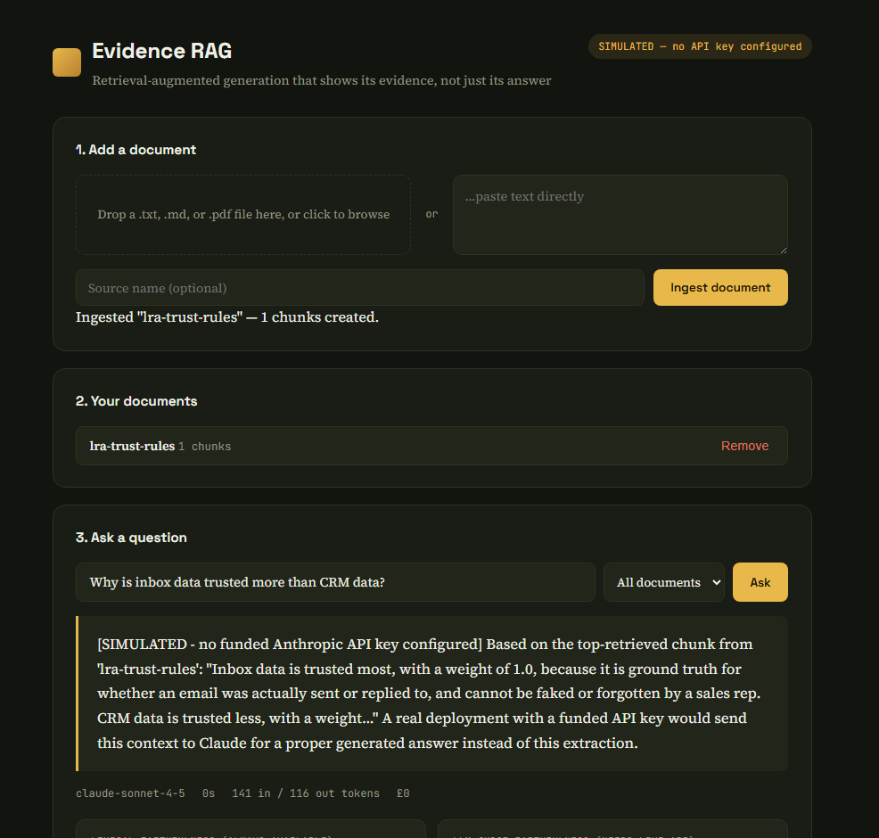
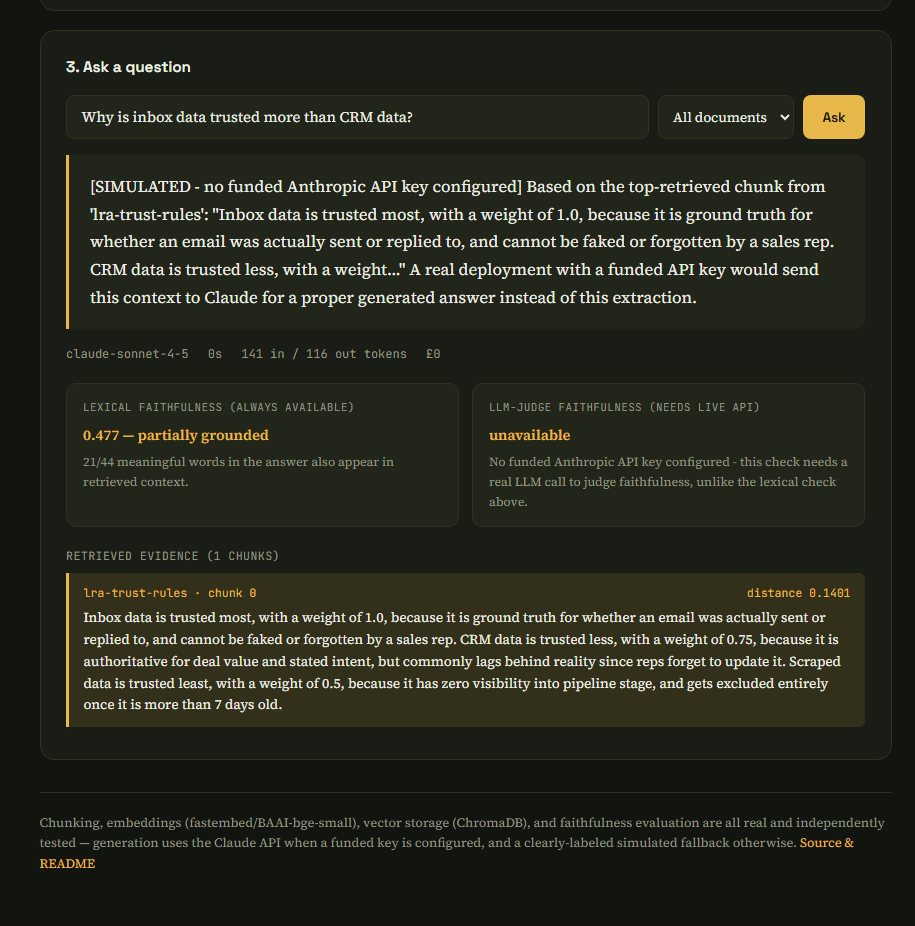

# Evidence RAG

A retrieval-augmented generation pipeline that shows its evidence, not just its answer — real chunking, real embeddings, a real vector database, and a faithfulness evaluation harness that reports honestly even when the answer isn't well grounded.


[](https://github.com/dasheill26/evidence-rag/actions/workflows/tests.yml)

🔗 **[Live demo](https://evidence-rag.onrender.com)**

## Live, working — not just claimed

Real screenshots from the actual deployed instance, not a mockup:



A document gets ingested (1 real chunk created), a question gets asked, and — since no funded Anthropic API key is configured on this deployment — the simulated fallback kicks in exactly as designed, clearly labeled `[SIMULATED]`, extracting from the real top-retrieved chunk rather than fabricating an answer from nothing.



The honest part worth noticing: **lexical faithfulness scored 0.477 — "partially grounded," not a perfect 1.0.** That's the real number the evaluation harness produced on this real answer, shown as-is rather than picking a cleaner example for the README. The retrieved evidence chunk is shown directly below the answer with its actual distance score (0.1401), so anyone can check the answer against what was actually retrieved rather than trusting it blindly.

## Why this exists

Every project in this portfolio up to this point had a gap: no full RAG pipeline. Rather than claim experience that wasn't real, this project exists to close that gap honestly — a complete retrieval-augmented generation system built and tested end to end, not just described.

## What's actually in the pipeline

- **Chunking** — sentence-aware splitting with overlap, never cutting a sentence in half. Chunk size and overlap are real, documented tradeoffs (too large dilutes retrieval precision; too small loses context; overlap exists specifically so a fact near a chunk boundary isn't silently split across two chunks and fully present in neither).
- **Embeddings** — real semantic embeddings via [fastembed](https://github.com/qdrant/fastembed) (BAAI/bge-small-en-v1.5, 384 dimensions), not a hand-rolled or classical (TF-IDF-style) substitute. Chosen specifically over `sentence-transformers` because the latter pulls in the full PyTorch stack as a dependency — confirmed directly: it wouldn't even install in this project's development sandbox, running out of disk space on the PyTorch wheel alone. `fastembed` uses ONNX Runtime instead, dramatically lighter without giving up real embedding quality.
- **Vector storage** — real [ChromaDB](https://www.trychroma.com/) (HNSW indexing), not a hand-rolled cosine-similarity loop over a Python list. An earlier project in this portfolio ([Face Recognition Studio](https://github.com/dasheill26/face-recognition-studio)) implemented similarity search manually for a small, bounded gallery — a reasonable choice there, but this project uses the real thing specifically to close that gap too.
- **Generation** — the real Anthropic Claude API, with a clearly-labeled simulated fallback when no funded API key is configured (same proven pattern as an earlier project, [Lead Reconciliation Agent](https://github.com/dasheill26/lead-reconciliation-agent)) — genuinely useful for a public demo where visitors shouldn't need their own API key, not just a testing convenience.
- **Evaluation** — two complementary faithfulness checks, not one: a lexical-overlap heuristic that's always available (no API call needed), and an LLM-as-judge check that asks Claude directly whether an answer is actually supported by its retrieved context. See "Evaluating LLM outputs, honestly" below — this is the part most RAG tutorials skip.

## Evaluating LLM outputs, honestly

A RAG system can fail at two genuinely different stages, and conflating them is a common mistake: retrieval can fail to find the right information, or generation can hallucinate beyond whatever was actually retrieved. This project evaluates both separately.

**Retrieval evaluation** (`evaluate_retrieval`) checks hit-rate and rank against a test set of questions with known correct sources — a real precision-style check, not a vibe check.

**Faithfulness evaluation** has two methods, each honestly labeled with what it actually measures:
- *Lexical overlap* (always available): what fraction of the answer's meaningful vocabulary also appears in the retrieved context. Cheap, always on — and genuinely limited, confirmed by testing, not just noted as a caveat: a fully fabricated answer that keeps the same generic sentence structure as the source ("the system uses X and achieved Y percent accuracy") can still score ~0.4 purely from sharing connector words like "uses"/"achieved", even when every specific claim is invented. That's exactly why the second method exists.
- *LLM-as-judge* (needs a funded API key): asks Claude directly whether an answer is supported by its context — checks actual semantic support, not vocabulary overlap. Honestly reports "unavailable" rather than fabricating a score when no key is configured.

## Real bugs found during development (not hypothetical)

1. **A genuine data-loss bug in vector storage.** Chunk storage IDs were originally `f"{doc_id}::{chunk_index}"` — not actually unique if two different documents ever get ingested under the same `doc_id`, since each document's chunks are independently 0-indexed. Confirmed directly: ingesting a second document under a reused `doc_id` silently overwrote the first document's chunk-0 entry, with no error — the second document appeared to have been added successfully, but its predecessor's data was gone. Fixed with a genuinely unique ID per chunk regardless of `doc_id` reuse; the API layer also generates a fresh UUID per upload so this shouldn't occur in normal use, but the underlying fix protects against it either way.
2. **A tokenizer bug that let hallucinated numbers "match" real ones.** The lexical faithfulness tokenizer split on decimal points, so `50.99` and `99.9` spuriously shared the substring `99` even though they're completely different numbers, inflating the faithfulness score for a genuinely fabricated statistic. Fixed by treating decimal numbers as single tokens.
3. **A ChromaDB client-lifecycle bug that only showed up under test isolation.** Creating a new `PersistentClient` on every database call produced `attempt to write a readonly database`, confirmed directly rather than assumed to be flaky. Caching a single client fixed the basic case — but test isolation via deleting and recreating the on-disk directory between tests turned out to be a second, deeper problem: creating a second client at the same path within one process fails the same way even after dropping the Python reference to the first one. Reproduced outside pytest to confirm it wasn't a pytest-specific quirk, then fixed properly by switching test isolation to a uniquely-named ChromaDB collection per test rather than fighting the client's intended one-per-process lifecycle.

## Architecture

```
evidence-rag/
├── backend/
│   ├── app/
│   │   ├── engine/
│   │   │   ├── chunking.py      # sentence-aware chunking with overlap
│   │   │   ├── embeddings.py    # fastembed wrapper
│   │   │   ├── vectorstore.py   # ChromaDB wrapper
│   │   │   ├── rag_pipeline.py  # ties it together, real/simulated generation
│   │   │   └── evaluation.py    # lexical + LLM-judge faithfulness, retrieval eval
│   │   └── routes.py
│   └── tests/
├── static/                       # vanilla JS frontend
├── templates/
└── Dockerfile                    # single service, Flask serves API + frontend
```

## Running it

```bash
cd backend
python -m venv .venv && source .venv/bin/activate
pip install -r requirements.txt
python run.py    # http://127.0.0.1:5004
```

Set `ANTHROPIC_API_KEY` in a `.env` file (see `.env.example`) to use real generation and LLM-judge evaluation — without it, the app runs in simulated mode, clearly labeled in the UI, with retrieval and lexical evaluation still fully real.

### Docker

```bash
docker build -t evidence-rag .
docker run -p 5004:5004 -e ANTHROPIC_API_KEY=your-key-here evidence-rag
```

## Tests

```bash
cd backend && pytest tests/ -v
```

19 tests: chunking correctness (never splits mid-sentence, overlap genuinely works), the two vector-store regression tests above, the tokenizer regression test, faithfulness checks correctly rank grounded above hallucinated answers, LLM-judge response parsing (via mocking a real-shaped Claude response), the full pipeline end to end, and API contract tests. Embeddings are mocked with deterministic vectors of the real 384 dimension in tests — for the same network-restriction reason documented in `embeddings.py`, not because the mechanics around them (chunking, storage, retrieval ordering, metadata filtering) aren't tested for real, which they are.

## What I'd do with more time

- **A proper retrieval test set** with a larger number of known question/answer pairs to get statistically meaningful hit-rate numbers, rather than the handful used during development.
- **Re-ranking** — retrieve a larger candidate set with the fast embedding model, then re-rank the top candidates with a more expensive but more accurate cross-encoder before generation.
- **Streaming responses** for the generation step, rather than waiting for the full answer before displaying anything.
- **Persisting evaluation results** over time, so faithfulness/retrieval quality can be tracked as documents or questions change, not just computed fresh on each query.

## License

MIT — see [LICENSE](LICENSE). Built on [fastembed](https://github.com/qdrant/fastembed) (Apache 2.0) and [ChromaDB](https://github.com/chroma-core/chroma) (Apache 2.0).
